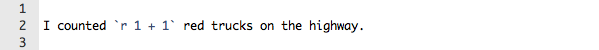

## How can we create reproducible reports?

We've already learned a bit about creating R scripts that allow us to rerun our analysis and even produce figures in a reproducible way.   But how do we incorporate the results of our analysis and figures into a report?  

### Option 1: Exporting figures to Images and importing them into report

You can export figures to images and paste them into a word processor like Microsoft Word.   This sort of works, but everytime you rerun your analysis you will need to update your numbers, tables and figures in your Word document.  

```{r}
x <- seq(1,10,by=0.1)
y <- sin(x)

png("myfigure.png")
plot(x,y)
dev.off()

# You can specify the output location, size, background color, etc..

png("figure/myfigure2.png", width=600, height=400, units="px", bg="light gray")
plot(x,y)
dev.off()

# Other options for graphic output include tiff, bmp, and jpeg
# See help file (i.e. ?png) for details

```

Note that when you save your plot to a file you don't get to see the plot until you open the file you saved.

The next step would be to import those plots as images into your Word document.

Of course if you rerun your analysis and your figures change you will need to reimport them into your report.


## Option 2:   Knitr and R Markdown

RStudio has several tools built in that allow you to create all of your report (figures, text, tables, etc..) in one simple file.  The easiest of these tools to start to use is a package called "knitr" and a new syntax called "Markdown" that you use to insert your R code within your report.

### Starting out 

To start a new report using R Markdown and Knitr you will need to create a new R Markdown ".Rmd" file.  This is one of the options for file type in RStudio when you go to create a new file.

**File > New File > R Markdown**

Starting an R markdown file will also change tool bar above the document a bit from what you normally see with a basic R script file.  More on that in a bit.

By default, your new R Markdown file will have some example markdown code.  Take a look at that code..

There is the word **"title"** with a line of equal signs **"==="** underneath.   The equal signs make the word **"Title"** the title or top header of this document.

Subsequent headers can be written using **"#"** a series of one or more hashes to tag your header text.  In fact, a single hash **"#"**  at the beginning of some text is equivalent to a Header 1 created with **"===="** under the text.  Header 2 can be tagged with **"------"** a line of single dashes under a line of test, or by tagging the text with **"##"** double hashes at the begining of the text.  

Header 1 = **"# some text"** 

Header 2 = **"## some text"**

Header 3 = **"### some text"**

etc..


Below that is a couple sentences of text.  The words surrounded by double asterix "**" are going to be emphasised/bold 

After this text is our first chunk of R code.  You specify R code useing the three single back quotes followed by **"r"** in curly brackets **"{}"**.  You can find the single back quote on most windows keyboards just to the left of the 1 key.   Alternatively you can create a new chunk of R code using the "insert chunk" option in the "Chunks" menu.   The keycode **"Cntrl+Alt+I"** is an even quicker shortcut for this.

Within this first chunk of R code you will see some basic R code.  In this case the summary of the cars dataset.

In the second chunk we see R code for the plot of the cars dataset.   Note that the size of the figure output (**"fig.height"** and **"fig.width"**) are options of the chuck header. 

### Knitting your R Markdown file

Keeping the R markdown that was written by default in your new file, click on the "Knit HTML" button in the tool bar.  This will execute the R code and format your text according to markdown rules and create some HTML output which should pop up for your viewing.

### Other knitr options

You will notice that be default the output of your R code chunks is to repeat your code and then display the results.  

What if you don't want your R code being repeated and just want the output in the report?  Then use the "echo=FALSE" option.   

**{r, echo=FALSE}**

Or if you want the code to show, but don't want the results to show use "eval=FALSE"

**{r, eval=FALSE}**

Go ahead and edit the default markdown text in your new file and try these options out.


### Inserting figures

Figures can be inserted directly into a document by placing the code in one of the **{r}** chunks.  Your figure will be saved as a png file in a subdirectory named "figure" within your current working directory.  You can of course specify some figure style within your **{r}** chunk.

For example, if I use the following options, I can center the figure add a caption.

***{r, fig.align="center", fig.cap="Figure 1: this is the caption"}***

```{r, fig.align="center", fig.cap="Figure 1: this is the caption"}

plot(x,y)

```

### Inline R Code

You can also evaluate R code outside of the chunks.  The format is single backquote, the letter r, your bit of r code, and closed with another single backquote.  For example.. 



Which will produce **"I counted `r 1 + 1` red trucks on the highway."**

This can useful in your report when you want to include summary or calculated information about your analysis within a sentence or your report's text. 


### inserting images


### Getting help with markdown syntax

The R Markdown Reference Guide from RStudio

https://rmarkdown.rstudio.com/index.html

You'll want to take a look at that.


Like just about everything with R, you can dive deeper into R Markdown and Knitr and get it to do a whole lot more.  


